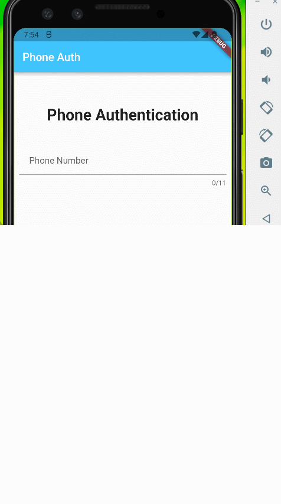

# to_do_app

It is a simple todo_app with phone authentication and stored data in firebase. Using getX state management and navigation.

## Table of Contents
* [App Features](#app-features)
* [Visualization](#visualization)
* [Packages used in project](#package-used-in-project)
* [Project Status](#project-status)
* [Contact](#contact)

## App Features
- Login Using Phone Number. 
- Send OTP to device. 
- Auto Verification of OTP. 
- Manually Entering OTP & Verifying it. 
- Adding tasks to do. 
- Marking the completion of tasks 
- Deleting tasks 
- Counting up the number of tasks  

## Visualization

## Packages used in project:

- [Firebase Core](https://pub.dev/packages/firebase_core)
- [Firebase Auth](https://pub.dev/packages/firebase_auth)
- [Cloud Firestore](https://pub.dev/packages/cloud_firestore)
- [GetX](https://pub.dev/packages/get)
- [PinPut](https://pub.dev/packages/pinput)
  

## Project Status
The project is completed. However, it needs more efficient updates and search tasks in Firestore. Nevertheless, it is sufficient for a project of this size. 

## Contact
Created by [@dbrzek](mailto:brzek.damian@gmail.com) - feel free to contact me!

>>>>>>>>>>>>>>>>>>>>>>>>>>>>>>>>>>>>>>>>>>>>>>>>>>>>>>>>>>>>>>>>>>>>>>>>>>>>>>>>>>>>>>>>>>>>>>>>>>>>>>>>>>>>>>>>>>>>>>>>>>>>>>>>>>>>>>